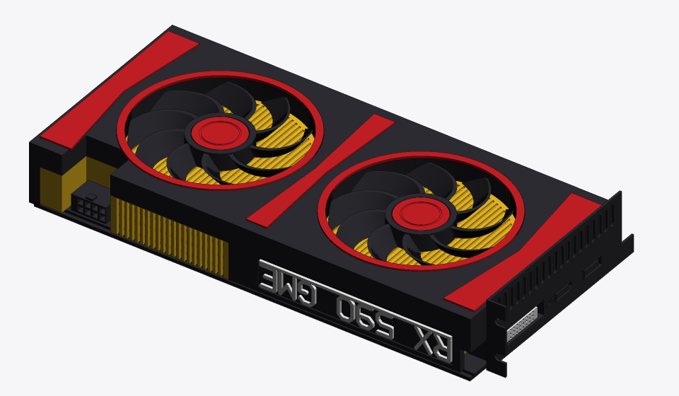
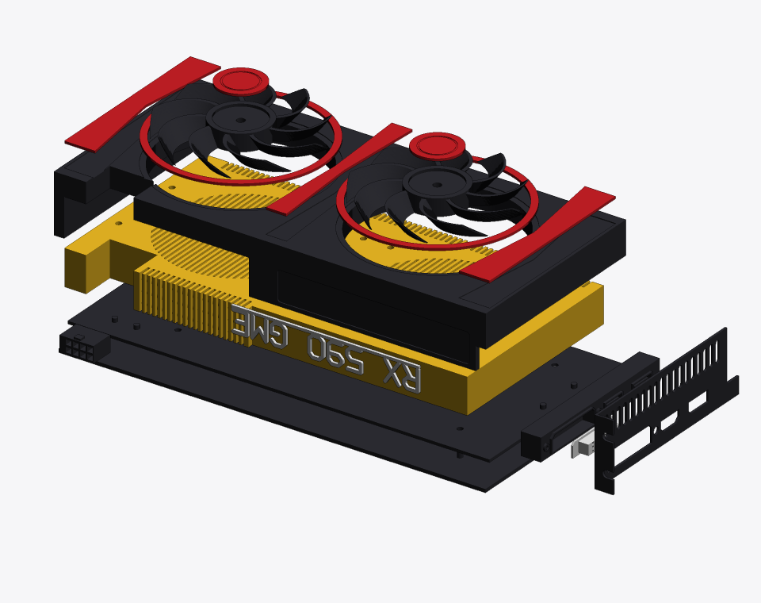
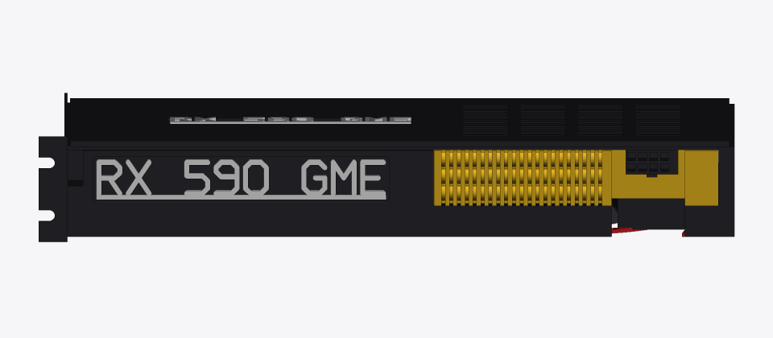
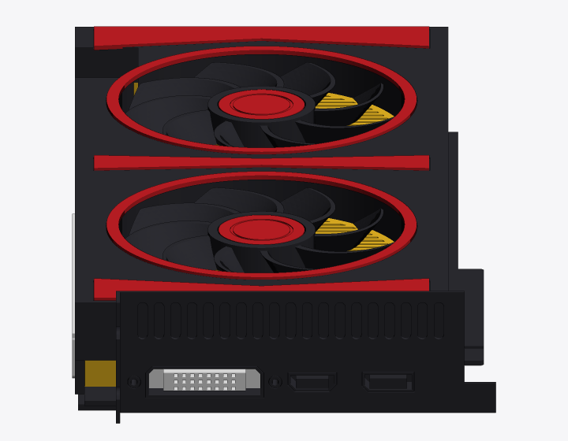
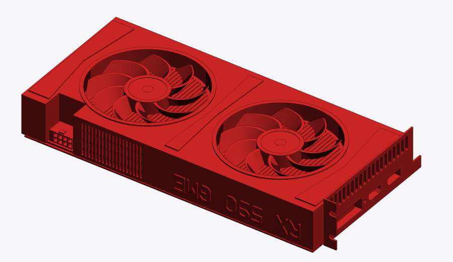
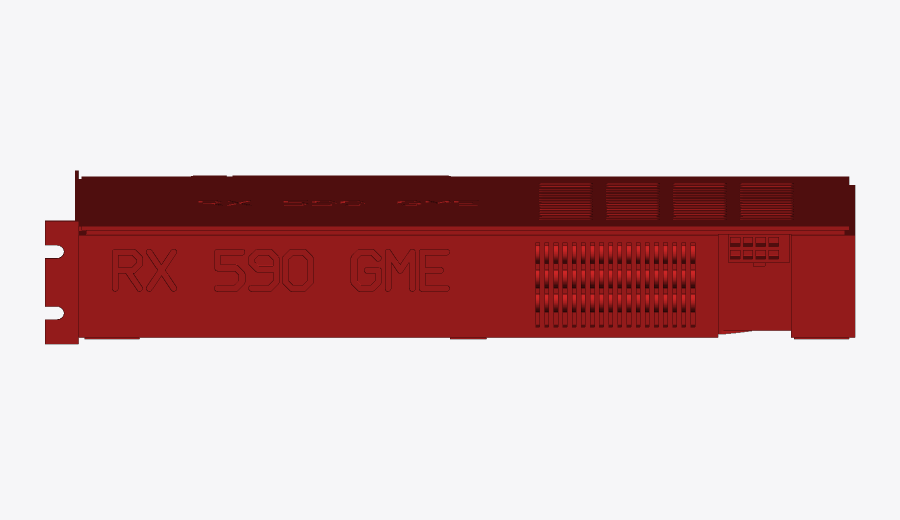
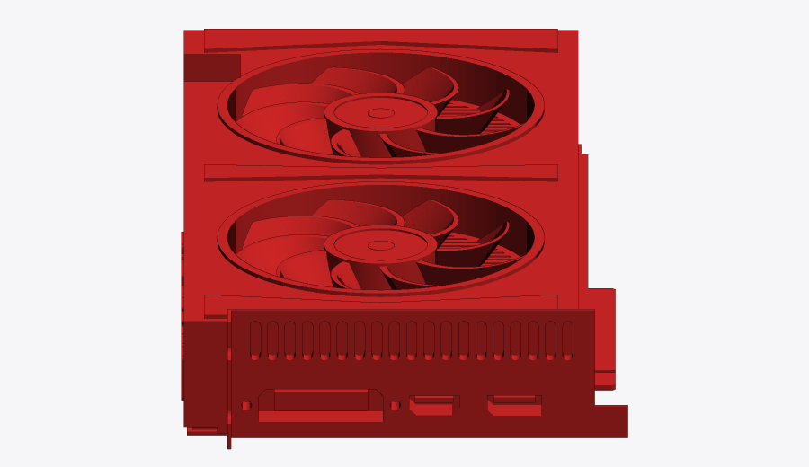

# 3D-printable RX 590 GME

A 3D-printable, 1:1 model of a dual-fan AMD Radeon RX 590 GME graphics card. It comes in two forms:

- **[Paint-and-assemble kit](#paint-and-assemble-kit):** 19 parts, each printed and painted in one colour and then assembled. Recommended.
- **[One-piece model](#one-piece-model):** the whole card as a single print, or two halves.

## Paint-and-assemble kit





| Installed (seen through a case window) | I/O bracket |
|---|---|
|  |  |

The kit stacks up like the real card. The backplate's pins pass through the PCB into the heatsink. The shroud's pegs then drop into the heatsink, so the layers line up by themselves. Bezels and accents sit in 0.6 mm recesses, and the two labels sit in recessed nameplate panels. The fan rotors turn on axles that are part of the heatsink, and each red hub cap is glued to its axle tip, not to the rotor. **The fans still spin after assembly.**

### Parts and colours

Files are in [`kit/`](kit/), named `NN_part_colour.stl` and already in print orientation. No part needs supports.

| # | Part | Colour | Size (mm) | Notes |
|---|---|---|---|---|
| 1 | backplate | black | 252 × 118 × 6 | pins face up |
| 2 | backplate_label | white | 92 × 13 × 1.4 | "RX 590 GME" on an underline bar; glues under the backplate |
| 3 | pcb | black | 249 × 126 × 4 | includes the PCIe x16 edge; prints flat, so the fingers need no support. Optionally paint the fingers yellow/gold. |
| 4 | heatsink | **yellow** | 236 × 118 × 32 | the grille seen through the fans, edge fins, heatpipes and fan axles |
| 5 | shroud | black | 255 × 118 × 35 | printed upside down, top face on the bed |
| 6, 7 | fan_rotor_1/2 | black | 88 × 88 × 10 | 9 blades each |
| 8, 9 | hub_cap_1/2 | red | Ø 27 × 1.4 | glue to the axle tip only |
| 10, 11 | fan_bezel_1/2 | red | Ø 98 × 1.4 | |
| 12–14 | accent_front/middle/rear | red | 18 / 12 / 18 × 106 × 1.4 | the middle accent also covers the split line of the split shroud |
| 15 | edge_label | white | 111 × 15 × 1.4 | top edge; reads correctly through a case window |
| 16 | io_bracket | black | 41 × 120 × 11 | printed with its inner face on the bed |
| 17 | port_block | black | 13 × 100 × 13 | DVI, HDMI and DisplayPort shells |
| 18 | dvi_insert | white | 9 × 35 × 7 | the pin block inside the DVI port |
| 19 | power_connector | black | 20 × 14 × 11 | 8-pin PCIe power |

Colour count: 8 black, 7 red, 3 white and 1 yellow. You can print everything in one filament and paint it, or print in coloured filament and skip the painting.

### Bed size

The four long parts (backplate, PCB, heatsink and shroud) are up to 255 mm long, so they need a bed of about 260 mm or more. For smaller printers, [`kit/split/`](kit/split/) has each of those parts in two pieces, giving **23 parts in total, none larger than 163 mm**. That fits any bed of 180 × 180 mm or more. The joints are staggered: backplate at 90 mm, PCB at 150 mm, heatsink and shroud at 128 mm. Each layer is glued across the joints of the layers above and below it, so the finished card is stiff. The red middle accent hides the shroud joint.

### Print plates (3MF), easiest option

[`kit/plates/`](kit/plates/) has the whole kit already laid out on **10 plates for a 220 × 220 mm bed** (Adventurer 5M, Bambu A1, Ender 3 V3 and similar). Each plate holds one colour, and the long parts are already split. Open a plate, slice it and print it.

| Plate | Colour | Parts |
|---|---|---|
| 01 | black | PCB front half (with the PCIe edge), I/O bracket, port block, 8-pin connector |
| 02 | black | backplate rear half |
| 03, 04 | black | shroud halves |
| 05 | black | PCB rear half, backplate front half |
| 06 | black | both fan rotors |
| 07 | red | fan bezels, hub caps, accents |
| 08 | white | both labels, DVI insert |
| 09, 10 | yellow | heatsink halves |

To lay the kit out for a different bed, run `python plates.py --bed 256`. Beds of 272 mm or more get the long parts unsplit.

### If the parts look far too big in your slicer

The files are in millimetres; the biggest split piece is 163 mm. STL files don't record their units, though, and some slicers assume inches, which makes everything **25.4× too big**. A 163 mm part then shows as about 4.1 m. Fixes:

- **Use the 3MF plates.** 3MF files record millimetres, so this can't happen.
- In the slicer, check the part's size and scale. It should be 100% and read in mm. If your slicer asks whether to convert from inches when you import, answer **no**.
- As a last resort, scale by 3.937% to undo inches, or by 10% if it was read as centimetres.

### Assembly

1. Put the backplate (1) on the table, pins up. Glue the white label (2) into the recess on its underside.
2. Drop the PCB (3) over the backplate pins.
3. Press the heatsink (4) onto the same pins and glue it.
4. Push the port block (17) and the 8-pin connector (19) onto the PCB pegs. Slide the white DVI insert (18) into the DVI shell.
5. Lower the shroud (5) over the heatsink; its pegs locate it. Glue it.
6. Slide the fan rotors (6, 7) onto the axles. Put a drop of glue on each axle tip (not on the rotor) and press a hub cap (8, 9) on.
7. Glue the red bezels (10, 11) and accents (12–14) into their recesses on the shroud. Glue the white edge label (15) into the recess on the top edge.
8. Fit the I/O bracket (16) over the port shells, then glue it to the port block and to the front of the shroud.

**Putting it in a PCIe slot:** the edge connector's key position and thickness (1.6 mm) follow the PCIe spec. The distance from the fingers to the I/O bracket, however, is my estimate. I couldn't get the official drawing. Before gluing anything, dry-fit the bare PCB (3) in your motherboard slot. Then hold the bracket against the case's slot opening and check that they line up. If they don't, tell me how far off it is and the model can be adjusted. Don't use metallic or conductive paint on the fingers. PLA and ordinary paint are non-conductive and harmless in a slot.

Paint each part before assembly. The recesses give clean edges between colours without masking. All mating parts have 0.2 mm of clearance. If your printer runs tight, sand the pegs lightly.

To regenerate or tweak the kit, run `python kit.py --split --previews ../docs` and then `python plates.py`. Stack heights, peg positions and clearances are constants at the top of [`kit.py`](kit.py).

## One-piece model



| Installed (seen through a case window) | I/O bracket |
|---|---|
|  |  |

What's modelled:

- **Two 88 mm fans** with 9 swept, twisted blades each. They sit in recessed shrouds with a finned heatsink floor.
- **Shroud with bezels and accents:** raised fan bezels and angular accent panels.
- **Heatsink fins** showing along both long edges.
- **Three heatpipes** crossing the exposed fins on the top edge.
- **"RX 590 GME" in raised letters** on the top edge. It reads correctly when the card is installed and seen through a case window.
- **Backplate** with vent slots and an engraved label.
- **Dual-slot I/O bracket** with DVI-D (including thumbscrew holes), HDMI and DisplayPort openings, exhaust vents, and a fold-over screw tab.
- **PCIe x16 edge connector** with the correct key position and PCB thickness (1.6 mm).
- **8-pin PCIe power connector** with 2 × 4 pin sockets and a latch.

The dimensions follow a typical RX 590 GME dual-fan board such as PowerColor's Red Dragon: **255 mm long, 38 mm thick, dual-slot**. The card is about 121 mm tall above the PCIe edge. The styling is generic, with no vendor logos.

### Files (in [`stl/`](stl/))

| File | Size (x × y × z) | Use it when |
|---|---|---|
| `rx590gme_1to1.stl` | 266 × 134 × 41 mm | Your bed is at least 270 mm in one direction (Prusa XL, Ender 5 Plus, Neptune 4 Max, …) |
| `rx590gme_1to1_part1_bracket.stl` + `rx590gme_1to1_part2_rear.stl` | 139 × 134 × 41 and 127 × 121 × 38 mm | Full size on a normal bed (anything ≥ 180 × 180 mm). The card is split between the fans. |
| `rx590gme_1to1_pins_x2.stl` | two 4 × 18 mm pins | Aligning the two halves. A 4 mm dowel or two pieces of filament also work. |
| `rx590gme_1to2.stl` | 133 × 67 × 20 mm | A half-scale desk model. Thin walls are thickened so it still prints with a 0.4 mm nozzle. |

Every file is a single watertight (manifold) solid, except the pins file, which contains two separate pins.

### Printing

- **Orientation:** print as exported, with the backplate flat on the bed and the fans facing up.
- **Supports:** only needed under the PCIe edge connector, which sits 1.2 mm above the bed. "Supports on build plate only" handles it. Everything else is support-free. The port openings (up to 37 mm) and fin slots are short bridges.
- **Settings:** a 0.4 mm nozzle with 0.2 mm layers works well. Use 0.12 mm layers for the half-scale model or for sharper fan blades. Use 3 walls and 10–15 % infill. The card is a solid model (about 940 cm³ at full size), so low infill saves a lot of filament.
- **Material:** PLA or PETG. A black or dark grey print, with the accent panels and fan bezels painted red, looks like the real card.
- **Assembly of the split version:** push the two pins into one half, add a little CA glue on the cut faces, and press the halves together.

The edge connector has the PCIe key position and thickness, but its distance from the bracket is estimated. See the kit's note on putting it in a PCIe slot before relying on it.

### Customising

The model is generated by [`rx590gme_model.py`](rx590gme_model.py) from a single `Card` dataclass. Length, thickness, fan size and position, blade count, bracket slots and pocket depth are all parameters. To regenerate the STLs:

```bash
pip install -r requirements.txt       # manifold3d + numpy
python rx590gme_model.py              # writes stl/*.stl and prints sizes / triangle counts
python render_preview.py stl/rx590gme_1to1.stl preview.png --view installed
```

`render_preview.py` is a small NumPy z-buffer renderer that produced the images above. Its views are `iso`, `iso-pcie`, `fans`, `back`, `io`, `top-edge` and `installed`.

Dimension sources: PowerColor Red Dragon RX 590 GME listings (255 mm long, 38 mm thick, dual-slot, DVI-D + HDMI + DP, one 8-pin connector); the PCI Express CEM x16 edge-connector layout; and the standard full-height, dual-slot I/O bracket.
